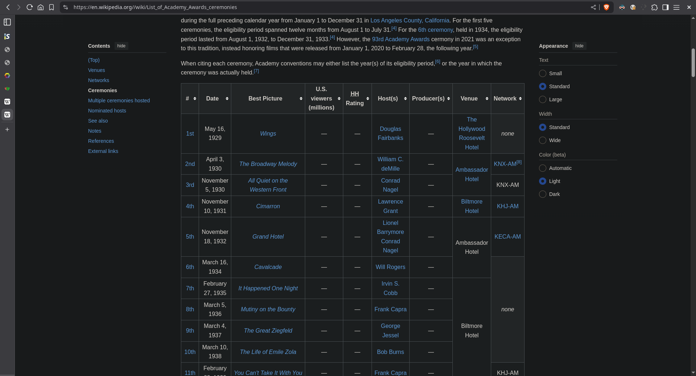
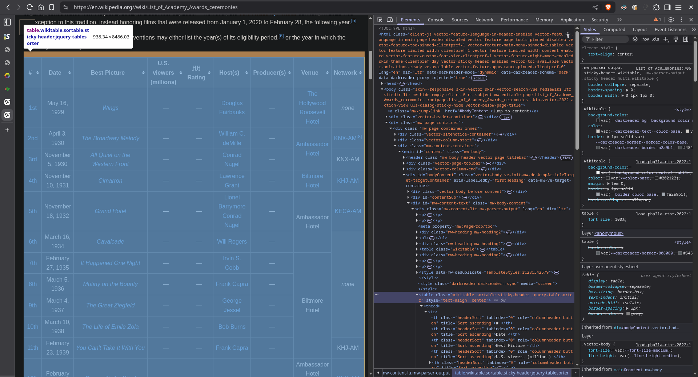

+++
title = 'Guia de webcrawler parte 1 - O que é webscrapper'
description = 'Pegar dados ou engatinhar sobre Apps?'
date = 2025-04-01T00:00:00-03:00
tags = ["python", "elixir", "wikipedia"]
cover = 'cover.png'
+++

## Disclaimer

Arte não tem preço , o intuito aqui não é dizer que filme X ou Y vale mais ou menos com base no preço, mas como fã de arte e do ecosistema do Jovem ~Velho~ Nerd , e como pessoa que acha muito dahora o trabalho do Anderson Gaveta, eu gosto de entender as coisas desse mundo.

## Política da boa vizinhança (17/08/2025)

A Web é como seu bairro/cidade, seja um bom vizinho.

Apesar do artigo abaixo demonstrar como extrair dados de um site, precisamos entender quem em eras nefastas do que chamamos de internet, alimentadas pelo Hype de AI e LLM, devemos manter a política de boa vizinhança.

Devido a demanda da industria por escanear indevidamente todo o conteúdo postado, instituições que por muitos anos mantiveram seu trabalho disponivél de forma pública e gratuita, estão sobre ataque constante de robôs e raspagem de dados originados por big techs e adjacentes, os quais violam licenças e termos de distribuição com licençás copyleft, principalmente Creative Commons.

webscrapper ou webcrawler deve ser a última opção, seja um bom vizinho , não faz mal perguntar ao dono do conteúdo quais os termos para uso deste, se ele possui uma API , e até combinar horários e consultas periódicas.

# Um pouco de storytelling...

Era fim de carnaval, eu estava levemente acoolizado em casa e altamente entediado, assistindo a festa do Oscar com a vitória de "Ainda Estou Aqui" e fazendo vários nadas, quando vi um debate idiota no Twiiter (Me recuso a chamar de X) sobre implicações de uso de dinheiro da Lei Ruanet no financiamento do filme.

Obvío que uma bela de uma fake news, mas fiquei pensando com os dois neurônios que ainda me restavam pré-ressaca "O quanto custa ganhar um Oscar", isto é, qual a característica financeira dos filmes indicados, vencedores e perdedores.

Me lembrei de algum vídeo do Gaveta, falando sobre essa coisa de usar como propaganda do filme o seu "Baixo Custo" e que isso não é de hoje, como fã de Interstellar eu lembro de todo burburinho na época de lançamento dessa obra-prima, sobre o quão barato foi o filme , mesmo tendo efeitos especiais malucos.

Eu sei que há todo um debate sobre efeitos práticos x especiais desde toda a história por trás do [fenômeno Barbiehimer](aaaa)

Então no meio dessa enchurradas de pensamentos pensei, eu sou um dev que tem skill o suficiente pra fazer uuma dataset e entender esse fenômeno. As 1h da manhã de um domigo (ou segunda) de carnaval, toda energia nervosa após assistir a cerimnônia do oscar, me fez ligar o notebook e começar a codar essa loucura.

O resultado foi que eu fiz um Raspador de dados usando a Wikipedia, Integrei resultados usando a API do OMDB. O resultado [pode ser visto aqui](https://oscarinsights.streamlit.app/)

Mas o que foi esse Scrapper (Raspador) e porquê não um Crawler?

# Um pouco sobre web

Todo site que navegamos, tudo aquilo que usamos na internet, de alguma forma é renderizado pelo navegador usando HTML, como já sabemos, HTML é Hypertext Template Markup Language, ou seja, uma forma de usar linguagem de marcação e hipertexto , para representar objetos visuais no seu navegador.

Esse HTML é uma estrutura estática, que gera a composição de uma estrutura dinâmica que é aquela que o seu navegador interage, chamamos isso de DOM (Document Object Model).

Ao clicar no botão postar de uma rede social , botão esse representado pelo HTML, usamos o Javascript, para realizar mudanças na DOM após determinado evento, nesse caso a confitrmação de criação do post no servidor da rede social, e é aqui que começamos nossa jornada de navegação de extração de dados.

# Scrapper

Um scrapper, é a técnica de raspar dados dessas estruturas que temos, sem necessáriamente interagir com elas, podemos dizer que esse é o nivél um de webcrawler, é como se entendessemos tudo como uma grande Wikipedia.

Navegamos por links, que renderizam docuemntos, artigos e afins, e usando a estrutura do HTML , navegamos por esse documento, encontrando as informações que precisamos.

Como o HTML é uma estrutura , não precisamos de um navegador para interagir com ele, como eu disse é um arquivo estático.

Scrappers por não depender de navegadores , possuem a vantagem de serem mais "baratos" em termos de uso de recurso , serem mais escalavéis , porém, por justamente não usarem de um navegador, não são capazes de reproduzir dados e eventos que são consequências da interatividade, ou seja, não são capazes de entender ou provocar mudanças na DOM.

## Mexendo com a DOM e HTML

Antes de começar quaisquer scrapper, eu sempre recomendo o passo de reproduzir com suas proprias mãos, os caminhos que quer seguir até chegar aos dados desejados. Ainda que ferramentas como o Playwright possuam recursos de navegador integrado como [pode ser visto aqui](https://playwright.dev/docs/codegen)

## Ferramentas comuns

Para raspagem de dados mais simples , não precisamos nem de uma framework ou algo complexo, podemos usar inclusive não uma, mas várias linguagens de programação.

O nivél mais básico de um scrapper consiste em duas etapas:

1. Obter links e realizar requisições que retornem HTML , JSON ou XML
2. Fazer parseamento dos resultados obtidos navegando nas estruturas de HTML, JSON ou XML.

No geral você precisa de uma blibioteca de requisições, normalmente HTTP, como no caso do Python, podemos usar as libs `requests` ou `httpx`, ou até mesmo a lib nativa de rede `http`.

Para navegar em documentos precisamos entender as formas de estrutura dentro deles. No caso de XML e JSON não tem muito o que fazer, qualquer parser nativo ou não serve, no caso do Python, temos suporte a JSON na lib nativa `json` e `xml.etree.ElementTree` para XML

Mas HTML ten suas particularidades.

Ainda que haja bastante componente HTML hoje em dia, é dificil identificar conteúdo apenas por tags e id's de tags, afinal nem todo desenvolvedor pensa (ou precisa pensar) em como navegar por essas tags de forma dinâmica.

Porém há alguns caminhos.

Uma forma de navegar pelo html é usar `CSS selectors`, pois se pensarmos bem, o CSS, que fornece o estilo das páginas precisa ser injetado em algum lugar , e de alguma forma identificar quais objetos da DOM ele precisa intervir, ainda que seja um recurso builtin dos navegadores, ele pode ser reproduzido por algumas blibiotecas. O problema é que nem todo site usa ID's e classes CSS para definir estilos, sites mais rudimentares e simples como a Wikipedia possuem estilos definidos por tags e classes genéricas, tornando a navegação por estilo algo dificil, quando não impossivél de reproduzir certos caminhos.

A segunda forma de reproduzir navegabilidade pelo HTML é usando um recurso chamado de XPATH.

Essa palavrinha estranha (favor não confundir com XML) siginiica XML Path Language, uma forma de navegar em estrutura XML por meio de uma sintaxe de path, tipo o uso do comando cd ou import relativo do Javascript via path coisas como `..` para voltar um diretório e `./` como busca a partir deste diretório.

Como o HTML pode ser entendido como XML em termos de navegabilidade, do meu ponto de vista é a melhor forma de navegar por objetos pelos seguintes motivos:

1. Possui estrutura de posicionamento relativo, permitindo buscar objetos filhos de, irmãos de, abaixo de.
2. São estruturas que mudam menos que tags e classes do CSS, muitos sites quando fazem rebrand visual, mudam o CSS em si, mas preservam o HTML numa estrutura semäntica.
3. Para sites antiquados são a unica forma de navegar.
4. Pode ser facilmente testado em arquivos estáticos.

# Navegando pela Wikipedia.

Um resumo se chegou até aqui:

- Scrap ou raspagem de dados consiste em extrair informações de arquivos estáticos, normalmente HTML.
- São mais performáticos
- Não funcionam em páginas dinâmicas
- Precisa conseguir usar HTTP
- Navegar em arquivos usando `CSS Selector` ou `XPATH`

Agora vamos reproduzir a fatídica noite que decidi extrair dados do Wikipedia.

A primeira coisa que eu pensei foi: Preciso de uma lista com todas as cerimônias do Oscar que já ocorreram no passado, logo fui procurar na Wikipédia e cheguei na [página da wikipedia com as cerimônias do Oscar](https://en.wikipedia.org//wiki/List_of_Academy_Awards_ceremonies).

Nessa página possuimos uma tabela com as cerimônias, o nome e o link para a página da cerimônia na própria Wikipedia, perfeito, pois já adianta nosso trabalho de buscar uma forma de linkar essas coisas.

A primeira coisa que iremos fazer agora é descobrir como chegar a esta exata tabela, para isso entraremos no modo de inspeção do navegador, nessa etapa é crucial que esteja usando um navegador baseado no Chromiun, para conseguir reproduzir meus passos com fidelidade.



Na aba de elementos do modo de inspeção conseguimos encontrar nossa suspeita, a tabela que precisamos. 



Com o nosso elemento selecionado podemos fazer experimentos, ao clicar no representando do elemento na árvore do modo de inspeção , aparecerá as opções entre elas , Copiar (Copy), dentro desse Copy temos algumas opções:

- Copiar seletor (Copy selector): Copia o `CSS Selector`
- Copiar Xpath (Copy Xpath): Copia o caminho relativo do Xpath na página.
- Copiar Xpath completo (Copy Full Xpath): Copia o caminho completo absoluto do Xpath nessa página.

E aqui que encontramos a primeira armadilha:

Ao usar `CSS Selector` ele gera esse seletor aqui: `#mw-content-text > div.mw-content-ltr.mw-parser-output > table:nth-child(13)`

Pode funcionar mas ele possui alguns problemas:
- Ele confia em muitos nivéis de combinação de classes para uma div, `mv-content-ltr` refere-se a questão de acessibilidade linguística (Left to Right), ou seja, se o seu navegador tiver algum mecanismo de autotradução ou redirecionamento para páginas rtl (Right to Left) ele pode vir a não funcionar.
- O seletor pode falhar pois, ainda que existam apenas 4 tabelas dentro do seletor pai `#mw-content-text > div.mw-content-ltr.mw-parser-output > table`, no final ele indica para ir para a 13 tabela filha, ou seja, o seletor real é apenas `table:nth-child(13)`.

No final das contas , esse seletor é bem ruim e não é a prova de mudanças, surgindo uma nova tabela nessa página antes da 13, esse seletor vai estar errado.

Vamos tentar agora coipar o Xpath relativo, pois é esse que nos interessa, ele vai nos dar esse resultado aqui:

`//*[@id="mw-content-text"]/div[1]/table[2]`

Muito mais interessante, mais curto e preciso, pois ele pula direto para o elemento de Id `mv-content-text`, para a segunda tabela da primeira div.

Esse seletor já é mais a prova de mudanças de regionalidade, mas ainda confia que:
- O ID sempre vai existir e ser o mesmo
- Confia na mesma estrutura (uma div com a segunda tabela).


Então eu decidi usar meus poderes de ninja do Xpath, adiquiridos com anos de manutenção e má vontade no uso de webscrapper e decidi fazer um caminho mais relativo.

A minha idéia é buscar pelo titulo da tabela, e em seguida pela primeira tabela abaixco desse titulo. Dificilmente o pessoal da Wikipedia vai mudar o titulo da tabela de cerimônias para algo diferente de `Ceremonies`, normalmente a Wikipedia tende a manter essas tags de títulos de forma estavél para justamente facilitar esse processo de raspagem e indexação, assim ferramentas como Google conseguem usar ela melhor.

O Xpath seria `//h2[@id='Ceremonies']` que equivale a Econtre a primeira tag H2 com o ID 'Ceremonies', sendo que eu posso depois subistituir essa busca de id por content com contains .

Em seguida volto um nivél para atingir a div ao redor dessa tag, e por fim busco o irmão mais próximo que seja uma tabela, no final tendo o seguinte Xpath: `//h2[@id='Ceremonies']/../following-sibling::table[1]`

Dessa forma pouco me importa a estrutura de leitura ou a estilização da página, se houver um subtítulo Ceremonies, eu busco a tabela abaixo desse mais próxima.

Por isso e por pder usar algumas funções eu uso o Xpath na maioria dos casos.

## Botando a mão na massa

Apesar da primeira versão da análise do Oscar ter sido feita em Python, iremos usar o exemplo que fiz recentemente em `Elixir`, pois ai poderemos usar um pouco de interatividade do IEX hoje por questões didáticas.

Não vou ensinar nenhum de vocês a instalar o Elixir ou o módulo, ainda que , se quiserem reproduzir, este é o link do projeto.

O código que eu escrevi no final do dia ficou +- assim:

```elixir
defmodule WikipediaExtractor do
  import Meeseeks.XPath

  @base_url "https://en.wikipedia.org"

  def get_ceremonies do
    url = "#{@base_url}/wiki/List_of_Academy_Awards_ceremonies"

    with {:ok, %{body: body}} <- HTTPoison.get(url) do
      document = Meeseeks.parse(body, :html)

      table_ref = Meeseeks.one(document, xpath("//h2[@id='Ceremonies']/../following-sibling::table[1]"))

      case table_ref do
        nil -> {:error, :table_not_found}
        table -> parse_ceremonies_table(table)
      end
    else
      error -> {:error, "Failed to fetch ceremonies: #{inspect(error)}"}
    end
  end

  defp parse_ceremonies_table(table) do
    rows = Meeseeks.all(table, xpath(".//tr[position() > 1]")) # ignora cabeçalho

    Enum.map(rows, fn row ->
      columns = Meeseeks.all(row, xpath("./td"))

      if length(columns) >= 3 do
        number = columns |> Enum.at(0) |> Meeseeks.text() |> String.trim()
        date = columns |> Enum.at(2) |> Meeseeks.text() |> String.trim()

        %{
          "#" => number,
          "Date" => date,
          "url" => "#{@base_url}/wiki/#{number}_Academy_Awards"
        }
      else
        nil
      end
    end)
    |> Enum.reject(&is_nil/1)
  end

  def get_movies_all(ceremonies) do
    Enum.flat_map(ceremonies, &get_movies_from_ceremony/1)
  end

  defp get_movies_from_ceremony(%{"#" => num, "Date" => date, "url" => url}) do
    IO.puts("Fetching: #{url}")

    with {:ok, %{body: body}} <- HTTPoison.get(url) do
      doc = Meeseeks.parse(body, :html)

      case Meeseeks.one(doc, xpath("//*[@id='Winners_and_nominees']/../following-sibling::table[1]")) do
        nil -> []
        _table ->
          rows = Meeseeks.all(doc, xpath("//*[@id='Winners_and_nominees']/../following-sibling::table[1]//tr"))

          Enum.flat_map(rows, fn row ->
            parse_movie_row(row, num, date, url)
          end)
      end
    else
      err ->
        IO.puts("Erro ao buscar cerimônia #{num}: #{inspect(err)}")
        []
    end
  end

  defp parse_movie_row(row, num, date, wiki_url) do
    cells = Meeseeks.all(row, xpath(".//td"))

    Enum.flat_map(cells, fn td ->
      winner =
        Meeseeks.one(td, xpath(".//ul/li/b/i/a/text()")) ||
        Meeseeks.one(td, xpath(".//ul/li/i/b/a/text()"))

      category =
        Meeseeks.one(td, xpath(".//div/b/a/text()")) ||
        Meeseeks.one(td, xpath(".//div/b/text()"))

      nominations =
        Meeseeks.all(td, xpath(".//ul/li/ul/li/i/a/text()"))
        |> Enum.map(&Meeseeks.text/1)

      result =
        (if winner,
           do: [%{Movie: Meeseeks.text(winner), Category: category_text(category), Winner: true}],
           else: []) ++
        Enum.map(nominations, fn nom ->
          %{Movie: nom, Category: category_text(category), Winner: false}
        end)

      Enum.map(result, fn item ->
        Map.merge(item, %{:Ceremony => num, :Date => date, :Wikipedia_URL => wiki_url})
      end)
    end)
  end

  defp category_text(nil), do: "Unknown"
  defp category_text(node), do: Meeseeks.text(node)
end
```

Esse módulo elixir extrai a lista de cerimônias bem como os filmes participantes de cada cerimönias, ainda que haja outros exemplos de xpath interessantes , vamos nos concentrar na função  `get_ceremonies/0`.

Utilizamos a blibioteca HTTPoison para fazer a requisição da página do wikipedia, e em seguida, usamos a blibioteca Meeseeks para extrair os dados que queremos por meio do nosso Xpath.

Se encontrarmos a tabela em questão , fazemos o parse dela , senão emitimos um erro de tabela não encontrada.

O interessante do Meeseeks é que podemos pegar o resultado de uma Query , e usarmos ele para implementar outra Query, que é o que fazemos na busca dos elementos da table.

Para as demais extrações, não há mais segredos, apenas repetir essa estrutura de Interação:
1. Discoevr da página e mapear os XPath's e seletores que me interessam.
2. Implementar etapas em cima de cada seletor ou resultado obtido.
3. Criar testes e2e para cada caso
4. Repetir


Esse script não é perfeito, ainda existem edge cases que não mapeei nas cerimônias com mais de 40 anos, alguma coisa sobre a estrutura que não consegui resolver.

Para testar ele de forma iterativa podemos usar o iex no nosso projeto:

```bash
iex -S mix
```

```bash
Erlang/OTP 25 [erts-13.1.5] [source] [64-bit] [smp:8:8] [ds:8:8:10] [async-threads:1] [jit:ns]

Interactive Elixir (1.18.3) - press Ctrl+C to exit (type h() ENTER for help)
iex(1)> WikipediaExtractor.get_ceremonies |> Enum.take -2
warning: parentheses are required when piping into a function call. For example:

    foo 1 |> bar 2 |> baz 3

is ambiguous and should be written as

    foo(1) |> bar(2) |> baz(3)

Ambiguous pipe found at:
└─ iex:1:35

[
  %{
    "#" => "97th",
    "Date" => "Anora",
    "url" => "https://en.wikipedia.org/wiki/97th_Academy_Awards"
  },
  %{
    "#" => "98th",
    "Date" => "—",
    "url" => "https://en.wikipedia.org/wiki/98th_Academy_Awards"
  }
]
iex(2)> 

```

No exemplo acima, chamei a função `get_ceremonies/0` e usei `Enum.take` em pipe para pegar os dois ultimos elementos da lista, que são as duas últimas cerimônias, no caso a cerimônia de 2024, e a de 2025 que na data desse artigo ainda não ocorreu. 

# Considerações finais.

O uso de raspadores é muito abrangente, por ser a forma mais performática, se comparada a seu "irmão", os "crawlers" acaba sendo mais barata e fácil de escalar se comparado a outras.

Fazer tudo na mão como fizemos, nem sempre é viavél, para projetos simples como este aqui é o suficiente, mas projetos como o Querido Diário , que eu falo nesse post aqui, usamos uma framework que nos equipa com todo a estrutura de processos com coisas mais complexas, como ter vários raspadores, dados padronizados, pipelines de extração e envio de dados,controle de configurações de headers e local de origem das requisições.

Se precisa fazer projetos com maior diversidade de fonte de dados, como exemplo, um comparador de preços entre ecomerces diferentes, utilizar frameworks como [Scrapy](https://scrapy.org) do Python ou [Crawly](https://github.com/elixir-crawly/crawly) do Elixir podem ser mais viavél para seu projeto.

Fico por aqui e até a próxima.

# Referências

- **ANDERSON, Gaveta.** *Te enganaram: tem CGI em todos os filmes!* [S.l.]: Gaveta, [20--?]. Disponível em: [https://www.youtube.com/user/gavetafilmes](https://www.youtube.com/watch?v=F7bCcw-rWr8). Acesso em: 19 abr. 2025.

- **MEESEEKS.** *Meeseeks - Web scraper para Elixir*. GitHub, 2024. Disponível em: [https://github.com/mischov/meeseeks](https://github.com/mischov/meeseeks). Acesso em: 19 abr. 2025.

- **PLAYWRIGHT.** *Playwright Codegen*. Microsoft, 2025. Disponível em: [https://playwright.dev/docs/codegen](https://playwright.dev/docs/codegen). Acesso em: 19 abr. 2025.

- **SCRAPY.** *Scrapy - A fast high-level web crawling & scraping framework for Python*. Disponível em: [https://scrapy.org](https://scrapy.org). Acesso em: 19 abr. 2025.

- **WIKIPEDIA.** *List of Academy Awards ceremonies*. Wikipedia, The Free Encyclopedia, 2025. Disponível em: [https://en.wikipedia.org/wiki/List_of_Academy_Awards_ceremonies](https://en.wikipedia.org/wiki/List_of_Academy_Awards_ceremonies). Acesso em: 19 abr. 2025.

- **OMDB API.** *The Open Movie Database*. Disponível em: [https://www.omdbapi.com/](https://www.omdbapi.com/). Acesso em: 19 abr. 2025.


