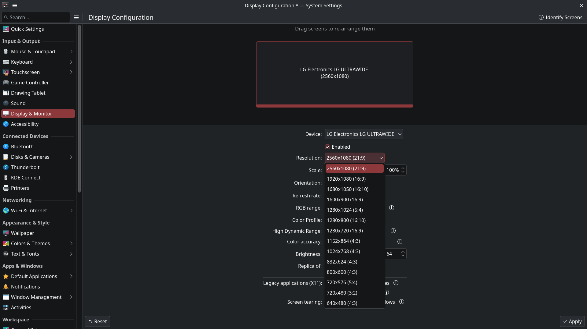

+++
title = 'VIBE troubleshoot: Configurando monitor ultrawide 21:9 no Linux'
description = 'O drama do HDMI 2.1 no Intel Ice Lake, a limitação de 165 MHz do LSPCON e como resolvi com EDID override e uma ajuda de um amigo chinês 🇨🇳'
date = 2026-08-10T18:45:00-03:00
draft = false
tags = ['linux', 'debian', 'hardware', 'monitor', 'intel', 'kde', 'opencode', 'deepseek']
cover = 'cover.png'
+++

# O início do caos

Eu nunca imaginei que um cabo HDMI 2.1 me faria perder tanto tempo da minha vida.

Mas antes de chegar lá, deixa eu apresentar o meliante:

```bash
❯ fastfetch
        _,met$$$$$gg.          v_raton@valhalla
     ,g$$$$$$$$$$$$$$$P.       ----------------
   ,g$$P""       """Y$$.".     OS: Debian GNU/Linux 13 (trixie) x86_64
  ,$$P'              `$$$.     Host: Vostro 15 3510
',$$P       ,ggs.     `$$b:    Kernel: Linux 6.12.100+deb13-amd64
`d$$'     ,$P"'   .    $$$     Uptime: 4 days, 1 hour, 22 mins
 $$P      d$'     ,    $$P     Packages: 4047 (dpkg), 16 (flatpak-system), 24 (flatpak-user)
 $$:      $$.   -    ,d$$'     Shell: zsh 5.9
 $$;      Y$b._   _,d$P'       Display (LG ULTRAWIDE): 1829x1029 @ 60Hz in 26" [External]
 Y$$.    `.`"Y$$$$P"'          DE: KDE Plasma 6.3.6
 `$$b      "-.__               WM: KWin (Wayland)
  `Y$$b                        WM Theme: Breeze
   `Y$$.                       Theme: Breeze (Dark) [Qt], Breeze-Dark [GTK2], Breeze [GTK3/4]
     `$$b.                     Icons: breeze-dark [Qt], breeze-dark [GTK2/3/4]
       `Y$$b.                  Font: Noto Sans (12pt) [Qt], Noto Sans (12pt) [GTK2/3/4]
         `"Y$b._               Cursor: breeze (24px)
             `""""             Terminal: tmux 3.5a
                               CPU: Intel(R) Core(TM) i5-1035G1 (8) @ 3.60 GHz
                               GPU: Intel Iris Plus Graphics G1 (Ice Lake) @ 1.05 GHz [Integrated]
                               Memory: 13.18 GiB / 15.28 GiB (86%)
                               Swap: 14.33 GiB / 54.57 GiB (26%)
                               Disk (/): 237.50 GiB / 315.95 GiB (75%) - ext4
                               Disk (/home): 208.69 GiB / 592.02 GiB (35%) - ext4
                               Battery (DELL XDY9K18): 100% [AC Connected]
                               Locale: en_US.UTF-8


```

Olha o `Display (HDMI-A-1): 1829x1029 @ 60Hz`. Repara que **não é** 1920x1080 e **muito menos** 2560x1080. O KDE tava empurrando um scaling de 1.05 sobre os 1920x1080 que o kernel expunha, resultando nessa aberração de 1829x1029. O monitor LG ULTRAWIDE — um legítimo 21:9 — sendo tratado como se fosse um 16:9 capenga, com 640 pixels horizontais mofando no escuro.

**Desde 2022** eu vinha tentando resolver isso. Troquei de cabo algumas vezes — primeiro um HDMI genérico, depois um "certificado 2.0", depois um DisplayPort→HDMI que também não resolveu. Vasculhei fóruns, Reddit, Stack Exchange, Arch Wiki... **nada**. Toda busca caía em threads sem resposta ou gente sugerindo trocar de distro ou jogar meu notebook fora como se fosse solução. Cheguei a me conformar com o monitor esticado por quase 4 anos.

O problema tava tão enraizado que até o [post de apresentação do blog](/posts/me/) — lá em 2023 — já tinha o neofetch cravando `Resolution: 1920x1080` pra um monitor que era 2560x1080 nativo. Eu nem percebia mais.

O pior de tudo: no **Windows** a resolução nativa funcionava perfeitamente. 2560x1080@60Hz, belezinha. O cabo era HDMI 2.1, o monitor suportava... então por que o Linux não?

# Me rendi ao vibe troubleshoot

Semana passada, no tédio de uma tarde, resolvi testar o [OpenCode](https://opencode.ai) — uma CLI de IA pra engenharia de software — com esse problema de 4 anos. Abri uma sessão em modo **Plan** (só leitura, sem permissão de escrita nem sudo, porque né) e soltei:

> *"estou com monitor ultrawide conectado, o cabo é hdmi 2.1 e nao consigo configurar 21:9"*

O modelo da vez era o **DeepSeek V4 Pro** (Plano Go). E ele foi cirúrgico.

Primeiro, pediu um `xrandr`. O output veio zoado — a resolução `1829x1029` com a flag `RANDR Emulation: 1`, o que já entregava que eu tava no XWayland, não no X11 puro. Ele então puxou o `lspci`:

```
00:02.0 VGA compatible controller: Intel Corporation Iris Plus Graphics G1 (Ice Lake)
        Kernel driver in use: i915
```

De cara o LLM já suspeitou: *"O HDMI da Intel Ice Lake é limitado a HDMI 1.4 via LSPCON"*. Mas antes de concluir, foi atrás dos fatos.

Mandou um `xxd` no EDID bruto do monitor e achou os bytes `LG ULTRAWIDE` no meio do hexdump — o monitor tava se identificando corretamente. Depois um `edid-decode` completo revelou a verdade:

```
DTD 1:  2560x1080   59.978424 Hz  64:27    66.636 kHz    181.250000 MHz
         Hfront   48 Hsync  32 Hback   80 Hpol P
         Vfront    3 Vsync  10 Vback   18 Vpol N
```

O EDID tem o modo. O kernel **lê** o modo. Mas o driver **rejeita** o modo.

Nessa hora eu comentei *"estou usando wayland"* e o LLM pivotou na hora — trocou `xrandr` por `kscreen-doctor`, que confirmou: máximo exposto era `1920x1080@60`, com `"preferredModes": []`. Zero modos preferidos detectados para a porta HDMI. O kernel tava rejeitando tudo acima de 1920x1080.

# O LLM foi atrás das referências

Com o diagnóstico na mão, pedi pra ele verificar se alguém na internet já tinha resolvido. Ele disparou buscas no DuckDuckGo com queries como `Intel Ice Lake i915 HDMI ultrawide 2560x1080 resolution limit linux` e `dell ice lake laptop HDMI external monitor resolution 2560 not detected`.

Em segundos, me trouxe o ouro:

- Um repositório no GitHub: **[nic0der-im/fix-ultrawide-intel-notebook-hdmi](https://github.com/nic0der-im/fix-ultrawide-intel-notebook-hdmi)** — Dell Inspiron 3501 + LG Ultrawide, exatamente meu cenário, com script de EDID override e sistema de persistência via systemd
- Um tópico no [Intel Community](https://community.intel.com/t5/Graphics/Maximum-resolution-not-being-detected-Linux-driver-i915-and/m-p/1212593) — Lenovo S145, mesma GPU Iris Plus G1, mesmo monitor LG Ultrawide, mesmo sintoma
- Uma [discussão no Fedora](https://discussion.fedoraproject.org/t/maximum-possible-resolution-is-not-detected-in-gnome-wayland-with-i915-gpu/77492/2) confirmando que não era distro-específico
- Um post no [AskUbuntu](https://askubuntu.com/questions/1456885/cant-customize-resolution-2560x1080-for-ultrawide-monitor-in-ubuntu-22-04) com um Dell Vostro 3501, processador i5-1035G1 (meu CPU!)

O repositório do GitHub documentava a **causa raiz** com precisão cirúrgica:

O HDMI do Ice Lake **não é nativo**. A Intel implementa a porta HDMI dessas GPUs através de um chip **LSPCON** (Level Shifter/Protocol Converter), que converte DisplayPort em HDMI. Esse conversor opera como um adaptador **DP++ Tipo 1**, impondo um limite físico de **165 MHz** no TMDS clock — o mesmo teto do DVI single-link.

| Parâmetro          | Requerido (60 Hz) | Limite do hardware |
| ------------------ | ----------------- | ------------------ |
| Pixel clock        | **181.25 MHz**    | **165 MHz**        |
| Resolução          | 2560x1080         | máx ~1920x1200     |

O kernel i915 detecta isso, rejeita o modo com `CLOCK_HIGH` e só expõe modos até 1920x1080 (148.5 MHz, dentro do limite). Isso **não é culpa do cabo HDMI 2.1** — o gargalo está no chip conversor da GPU, antes mesmo do sinal chegar ao fio. Meus 4 anos trocando cabo foram em vão.

# A solução: EDID patcheado com 2560x1080@56Hz

Com a causa confirmada, o LLM me apresentou o plano:

> *"Reduzir o refresh para 56 Hz com reduced blanking → pixel clock cai para 162.20 MHz (dentro do limite de 165 MHz)"*

Antes de eu autorizar a execução, ele fez questão de listar os riscos: tela preta no HDMI, necessidade de bootar com kernel anterior pra reverter, e o fato de que nada era permanente — o EDID override existe só na RAM e some no reboot. Me tranquilizou e eu mandei bala.

A mágica dos números:

| Parâmetro       | Original (60 Hz) | Patcheado (56 Hz) |
| --------------- | ---------------- | ----------------- |
| Resolução       | 2560 x 1080      | 2560 x 1080       |
| Pixel clock     | 181.25 MHz       | **162.20 MHz**    |
| H Total         | 2720             | 2640 (reduced)    |
| V Total         | 1111             | 1097 (reduced)    |
| Refresh         | 60.00 Hz         | **56.01 Hz**      |
| vs. limite 165  | +16.25 MHz ❌    | -2.80 MHz ✅      |

Os 4 Hz a menos são **imperceptíveis** para uso desktop. Em troca, 33% mais área horizontal.

O plano de execução que o LLM orquestrou:

## Passo a passo

O guia completo está no repositório [nic0der-im/fix-ultrawide-intel-notebook-hdmi](https://github.com/nic0der-im/fix-ultrawide-intel-notebook-hdmi), mas resumi aqui a adaptação para **Debian + KDE Wayland**.

### 1. Verificar pré-requisitos

```bash
# Kernel precisa ter CONFIG_DRM_LOAD_EDID_FIRMWARE=y
$ grep CONFIG_DRM_LOAD_EDID_FIRMWARE /boot/config-$(uname -r)
CONFIG_DRM_LOAD_EDID_FIRMWARE=y

# Python 3 e edid-decode
$ python3 --version && which edid-decode
```

### 2. Criar o EDID patcheado

Script Python que lê o EDID do monitor, substitui o DTD 1 pelo modo 2560x1080@56Hz (162.20 MHz), ajusta o HDMI VSDB e recalcula checksums:

```python
#!/usr/bin/env python3
"""Patch monitor EDID for 2560x1080@56Hz over HDMI on Intel DP++ laptops."""

import sys

EDID_PATH = "/sys/class/drm/card0-HDMI-A-1/edid"
OUT_PATH = "/tmp/lg-ultrawide-2560x1080.bin"

with open(EDID_PATH, "rb") as f:
    edid = bytearray(f.read())

# DTD: 2560x1080 @ 56 Hz reduced blanking (162.20 MHz)
# HActive=2560 HBlank=80 (HFP=8, HSW=32, HBP=40) HTotal=2640
# VActive=1080 VBlank=17 (VFP=3, VSW=5,  VBP=9)  VTotal=1097
dtd_56hz = bytes([
    0x5C, 0x3F,              # pixel clock: 16220 × 10 kHz = 162.20 MHz
    0x00,                    # H active low 8 bits (2560 & 0xFF)
    0x50,                    # H blanking low 8 bits (80)
    0xA0,                    # H active high nibble (0xA) | H blank high nibble (0x0)
    0x38,                    # V active low 8 bits (1080 & 0xFF)
    0x11,                    # V blanking low 8 bits (17)
    0x40,                    # V active high nibble (0x4) | V blank high nibble (0x0)
    0x08,                    # H front porch (8 px)
    0x20,                    # H sync width (32 px)
    0x35,                    # V front porch (3) | V sync width (5)
    0x00,                    # upper bits (all zero)
    0x59, 0xFE, 0x20,       # image size: 601 × 254 mm
    0x00, 0x00,              # no border
    0x18,                    # non-interlaced, separate sync, -HSync -VSync
])

# Patch 1: Replace base EDID DTD 1 (offset 0x36)
edid[0x36:0x36+18] = dtd_56hz
edid[0x7F] = (256 - (sum(edid[:0x7F]) % 256)) % 256

# Patch 2: Find HDMI VSDB and set max_tmds_clock = 425 MHz
CTA = 0x80
dtd_off = edid[CTA + 2]

pos = CTA + 4
while pos < CTA + dtd_off:
    tag = edid[pos]
    btype = (tag >> 5) & 7
    blen = tag & 0x1F
    if btype == 3 and blen >= 3:
        oui = edid[pos+1] | (edid[pos+2] << 8) | (edid[pos+3] << 16)
        if oui == 0x000C03:
            vsdb_pos, vsdb_len = pos, blen
            break
    pos += 1 + blen

# Set max_tmds_clock byte (db[7] = 85 × 5 = 425 MHz)
edid[vsdb_pos + 1 + 6] = 0x55

# Patch 3: Replace first CTA DTD with 56Hz version
cta_dtd_start = CTA + dtd_off
edid[cta_dtd_start:cta_dtd_start+18] = dtd_56hz

# Fix CTA checksum
edid[0xFF] = (256 - (sum(edid[0x80:0xFF]) % 256)) % 256

with open(OUT_PATH, "wb") as f:
    f.write(edid)
print(f"Saved: {OUT_PATH}")

# Verify
import subprocess
subprocess.run(["edid-decode", OUT_PATH])
```

```bash
$ python3 patch-edid.py
[OK] Base EDID DTD 1 → 2560x1080@56Hz (162.20 MHz)
[OK] HDMI VSDB: max_tmds_clock = 425 MHz
[OK] CTA DTD at 0xBA → 2560x1080@56Hz
[OK] Checksums recalculated
```

### 3. Instalar o EDID e configurar o initramfs

Antes de chegar na solução final, tentamos dois caminhos. Vou narrar ambos porque as falhas são didáticas.

#### Tentativa 1: debugfs (bloqueado por kernel lockdown)

O primeiro plano do LLM foi aplicar o EDID via debugfs em runtime, sem precisar de reboot:

```bash
$ sudo cp lg-ultrawide-2560x1080.bin /sys/kernel/debug/dri/0/HDMI-A-1/edid_override
cp: cannot create regular file '...edid_override': Operation not permitted
```

**Bloqueado.** O kernel estava em **lockdown mode** — por causa de Secure Boot habilitado na UEFI. O lockdown impede escrita em `/sys/kernel/debug` para evitar que um processo userspace injete dados arbitrários em subsistemas do kernel que rodam em ring 0. Tentei duas vezes assinar módulos do kernel com `mokutil --import` pra ver se destravava — não adiantou. O lockdown bloqueia o debugfs independente de assinatura: é uma trava de integridade do kernel, não de autenticação de módulo. Depois de dois `mokutil` frustrados, aceitamos que o caminho era outro.

#### Tentativa 2: drm.edid_firmware (funcionou, mas precisou de hook manual)

O plano B foi usar o parâmetro de kernel `drm.edid_firmware=`. Primeiro copiamos o EDID para `/lib/firmware/edid/` e eu mesmo rodei `sudo update-initramfs -u`. Mas ao verificar:

```bash
$ sudo lsinitramfs /boot/initrd.img-$(uname -r) | grep lg-ultrawide
# (sem output — o EDID não foi incluído!)
```

O `update-initramfs` do Debian **não inclui automaticamente** firmwares customizados que não são conhecidos pelo kernel. Diferente de outras distros onde jogar o arquivo em `/lib/firmware` e rebuildar o initramfs é suficiente, no Debian o `initramfs-tools` só empacota firmwares que estão referenciados por módulos de kernel ou listados em hooks explícitos. O arquivo tava no disco, mas o initramfs ignorou — e sem ele lá dentro, o parâmetro `drm.edid_firmware=` seria ignorado em silêncio porque o KMS inicializa antes do root filesystem ser montado.

A solução foi **manual**: criar um hook do `initramfs-tools` em `/etc/initramfs-tools/hooks/edid-override`, dar `chmod +x`, rodar `update-initramfs -u` de novo, e verificar com `lsinitramfs` que o arquivo realmente entrou. Só depois disso o parâmetro de kernel faria efeito.

Por que isso funciona enquanto o debugfs falhou? Porque o firmware carregado via initramfs é um **blob de dados** (não código executável) — ele não precisa de assinatura de módulo de kernel, e o lockdown não interfere nesse caminho. É a mesma via que o kernel usa pra carregar firmware de WiFi, Bluetooth, etc.

```bash
# Copiar para /lib/firmware
sudo mkdir -p /lib/firmware/edid
sudo cp /tmp/lg-ultrawide-2560x1080.bin /lib/firmware/edid/

# Hook do initramfs pra incluir o EDID no early boot
sudo tee /etc/initramfs-tools/hooks/edid-override << 'EOF'
#!/bin/sh
PREREQ=""
prereqs() { echo "$PREREQ"; }
case "$1" in
    prereqs) prereqs; exit 0;;
esac

. /usr/share/initramfs-tools/hook-functions
mkdir -p "${DESTDIR}/lib/firmware/edid"
cp /lib/firmware/edid/lg-ultrawide-2560x1080.bin "${DESTDIR}/lib/firmware/edid/"
EOF

sudo chmod +x /etc/initramfs-tools/hooks/edid-override
sudo update-initramfs -u

# Verificar se entrou no initramfs
$ sudo lsinitramfs /boot/initrd.img-$(uname -r) | grep lg-ultrawide
usr/lib/firmware/edid/lg-ultrawide-2560x1080.bin
```

### 4. Adicionar o parâmetro no GRUB

Com o initramfs pronto, faltava injetar o parâmetro no boot. O OpenCode tentou editar o `/etc/default/grub` direto (e tomou `PermissionDenied`), então pivotou pra um `sed` com sudo:

```bash
$ sudo sed -i 's/GRUB_CMDLINE_LINUX_DEFAULT="quiet splash"/GRUB_CMDLINE_LINUX_DEFAULT="quiet splash drm.edid_firmware=HDMI-A-1:edid\/lg-ultrawide-2560x1080.bin"/' /etc/default/grub

$ grep CMDLINE_LINUX_DEFAULT /etc/default/grub
GRUB_CMDLINE_LINUX_DEFAULT="quiet splash drm.edid_firmware=HDMI-A-1:edid/lg-ultrawide-2560x1080.bin"

$ sudo update-grub
Generating grub configuration file ...
Found linux image: /boot/vmlinuz-6.12.100+deb13-amd64
Found initrd image: /boot/initrd.img-6.12.100+deb13-amd64
done
```

### 5. Verificar

Depois do reboot:

```bash
$ cat /sys/class/drm/card0-HDMI-A-1/modes | sort -u | grep 2560
2560x1080   # <- AGORA SIM
```

No KDE, a resolução 2560x1080@56Hz aparece como modo preferido nas configurações de tela — é só selecionar e aplicar.



```bash
$ kscreen-doctor --outputs
Output: 2 HDMI-A-1
    Modes:  15:2560x1080@56*!  <- preferred mode ativo
    Geometry: 0,0 2560x1080     <- pixel-perfect
    Scale: 1                     <- sem distorção
```

```bash
$ cat /proc/cmdline
... drm.edid_firmware=HDMI-A-1:edid/lg-ultrawide-2560x1080.bin
```

E o veredito final do `fastfetch` — reparando no que mudou desde o início do post:

```bash
❯ fastfetch
        _,met$$$$$gg.          v_raton@valhalla
     ,g$$$$$$$$$$$$$$$P.       ----------------
   ,g$$P""       """Y$$.".     OS: Debian GNU/Linux 13 (trixie) x86_64
  ,$$P'              `$$$.     Host: Vostro 15 3510
',$$P       ,ggs.     `$$b:    Kernel: Linux 6.12.100+deb13-amd64
`d$$'     ,$P"'   .    $$$     Uptime: 4 days, 1 hour, 36 mins
 $$P      d$'     ,    $$P     Packages: 4047 (dpkg), 16 (flatpak-system), 24 (flatpak-user)
 $$:      $$.   -    ,d$$'     Shell: zsh 5.9
 $$;      Y$b._   _,d$P'       Display (LG ULTRAWIDE): 2560x1080 @ 56 Hz in 26" [External]
 Y$$.    `.`"Y$$$$P"'          DE: KDE Plasma 6.3.6
 `$$b      "-.__               WM: KWin (Wayland)
  `Y$$b                        WM Theme: Breeze
   `Y$$.                       Theme: Breeze (Dark) [Qt], Breeze-Dark [GTK2], Breeze [GTK3/4]
     `$$b.                     Icons: breeze-dark [Qt], breeze-dark [GTK2/3/4]
       `Y$$b.                  Font: Noto Sans (12pt) [Qt], Noto Sans (12pt) [GTK2/3/4]
         `"Y$b._               Cursor: breeze (24px)
             `""""             Terminal: tmux 3.5a
                               CPU: Intel(R) Core(TM) i5-1035G1 (8) @ 3.60 GHz
                               GPU: Intel Iris Plus Graphics G1 (Ice Lake) @ 1.05 GHz [Integrated]
                               Memory: 13.42 GiB / 15.28 GiB (88%)
                               Swap: 14.29 GiB / 54.57 GiB (26%)
                               Disk (/): 237.50 GiB / 315.95 GiB (75%) - ext4
                               Disk (/home): 208.69 GiB / 592.02 GiB (35%) - ext4
                               Battery (DELL XDY9K18): 100% [AC Connected]
                               Locale: en_US.UTF-8
```

De `1829x1029 @ 60Hz` para `2560x1080 @ 56Hz`. Quatro anos esperando por essa linha no terminal. E tudo isso em **~35 minutos** de sessão com o [OpenCode](https://opencode.ai).

# Como esse troubleshoot foi feito

Esse post é fruto de uma sessão real de troubleshooting com o **OpenCode** usando o modelo **DeepSeek V4 Pro** (Plano Go). O fluxo foi:

1. **Diagnóstico em modo Plan** — o LLM só podia ler e inspecionar o sistema, sem permissão de escrita nem sudo. Ele puxou `xrandr`, `lspci`, `edid-decode`, `kscreen-doctor`, `cat /sys/class/drm/*/modes` e foi montando o quebra-cabeça sozinho.

2. **Pesquisa na internet** — quando eu perguntei se alguém já tinha resolvido, ele disparou buscas no DuckDuckGo, leu o README do repositório GitHub e posts no Intel Community e Fedora Discussion, extraindo a causa raiz documentada e validando contra o meu hardware.

3. **Plano de ação com avaliação de riscos** — antes de executar qualquer mudança, ele me explicou exatamente o que ia acontecer e quais eram os riscos (tela preta, necessidade de reverter pelo GRUB). Só avançou depois que eu confirmei.

4. **Execução com retry** — a primeira tentativa (debugfs `edid_override`) falhou por kernel lockdown (Secure Boot). Tentei assinar módulos do kernel duas vezes com `mokutil`, sem efeito. A segunda (initramfs sem hook) falhou porque o `update-initramfs` do Debian não inclui firmware customizado automaticamente — rodei o comando, verifiquei com `lsinitramfs` e não achou nada. Na terceira, o LLM gerou o hook do initramfs-tools, eu criei o arquivo manualmente (`sudo tee`, `chmod +x`), rebuildei, só então o `lsinitramfs` confirmou. Aí sim fomos pro GRUB com `sudo sed` (o editor direto tomou `PermissionDenied`). Cada falha foi diagnosticada e corrigida na mesma sessão.

5. **Validação pós-reboot** — depois do reboot, rodou `kscreen-doctor` e `fastfetch` pra confirmar que `2560x1080@56Hz` tava ativo como preferred mode.

A transcrição completa da sessão está disponível para download:

→ **Baixar transcrição da sessão:** <a href="/downloads/sessao-ultrawide-opencode.md" download>sessao-ultrawide-opencode.md</a> (Session ID: `ses_03687fa7dffeg1Gun9oO7z2Ay6`, 03/08/2026, DeepSeek V4 Pro / Plano Go)

# ⚠️ Riscos e responsabilidade

Antes de sair copiando e colando comandos que envolvem initramfs, parâmetros de kernel e patches binários de EDID, é importante entender onde você está pisando:

**O que pode dar errado:**

- Um EDID mal patchado (checksum errado, timings inválidos) pode fazer o kernel ignorar completamente o monitor externo no boot — **tela preta no HDMI**
- Um parâmetro de kernel incorreto no GRUB pode impedir o boot gráfico, forçando você a entrar em modo recovery pra reverter
- Aplicar isso no monitor errado ou com timings que excedem os limites reais do seu hardware pode causar **flickering**, **artefatos** ou o monitor nem ligar

**Nada disso é permanente nem danifica hardware**, mas você precisa saber **sair do problema**. Os mecanismos de segurança são:

| Se algo der errado...               | Como resolver                                  |
| ----------------------------------- | ---------------------------------------------- |
| HDMI não mostra imagem após reboot  | Bootar com kernel anterior no menu do GRUB     |
| Parâmetro quebrou o boot            | Editar a linha do kernel no GRUB (tecla `e`)   |
| Quer desfazer tudo                  | Remover `drm.edid_firmware=` do GRUB + reboot  |
| Modo novo causa flickering          | Selecionar 1920x1080 nas configs do KDE        |

O EDID override é **volátil** — ele existe só na RAM do kernel e desaparece no reboot se você remover o parâmetro. O monitor **nunca** é alterado fisicamente.

**Por que é importante entender o que está fazendo:**

Este tutorial foi gerado com ajuda de IA (OpenCode + DeepSeek V4 Pro) em uma sessão interativa onde **cada passo foi validado com comandos reais** no sistema antes de ser sugerido. A IA consultou o EDID real do monitor, verificou as capacidades do kernel, leu a documentação do i915 e referências cruzadas de outras pessoas com o mesmo hardware antes de propor a solução.

Se você está reproduzindo isso em casa:

1. **Confira o modelo exato da sua GPU** (`lspci | grep VGA`) — se for mais recente que Ice Lake, talvez nem precise desse hack
2. **Leia o EDID do seu monitor** (`edid-decode`) e confira as timings — não copie o DTD deste post cegamente, os timings podem variar conforme o modelo
3. **Teste primeiro com um kernel secundário** — se tiver múltiplos kernels instalados, teste o parâmetro em um deles antes de torná-lo padrão
4. **Verifique as fontes** — o repositório [nic0der-im/fix-ultrawide-intel-notebook-hdmi](https://github.com/nic0der-im/fix-ultrawide-intel-notebook-hdmi) é a referência canônica e tem o script original que foi adaptado aqui

Em resumo: **funcionou pra mim com esse hardware específico, mas faça sua própria diligência antes de aplicar no seu setup.**

# Conclusão

Nem tudo é o cabo. Meu HDMI 2.1 estava perfeito, mas o chip LSPCON do Ice Lake impunha um limite de 165 MHz que o kernel respeitava corretamente.

O EDID override com 56 Hz deu conta do recado — monitor rodando em 21:9 nativo, pixel-perfect, sem scaling artificial. Os 4 Hz a menos são insignificantes no uso diário, e a persistência via initramfs + parâmetro de kernel garante que sobrevive a reboots e atualizações.

Mas não foi na primeira tentativa. O debugfs falhou por lockdown do kernel (tentei assinar módulo duas vezes com `mokutil`, sem sucesso). O initramfs ignorou o firmware no primeiro `update-initramfs` — no Debian o hook não é automático, tive que criar o script na mão, dar `chmod +x`, rebuildar e verificar com `lsinitramfs`. O `sudo sed` foi necessário porque o editor direto tomou `PermissionDenied`. Três ciclos de erro → diagnóstico → correção (mais os dois `mokutil` no meio do caminho) até chegar no reboot vitorioso. E é exatamente esse tipo de iteração que faz uma sessão de troubleshooting valer a pena: cada falha ensina algo sobre como o sistema funciona.

Sobre o uso de IA: o termo "vibe" tem sido usado pra tudo, e por mais que eu tenha brincado com o termo no título, nada disso foi "vibe". Houve questionamento, pesquisa, análise de riscos, limitação de acessos quando necessário e três tentativas com falhas reais antes do acerto. O experimento aqui foi mostrar que deixar a IA assumir o controle pode dar resultado — desde que você seja cuidadoso e saiba onde está pisando.
