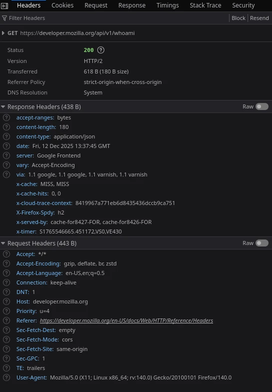

+++
title = 'REST API: Porquê você complica?'
description = 'Fazendo uma API REST descomplicada'
date = 2025-12-06T02:12:00-03:00
tags = ["python", "api", "rest", "http"]
draft = false
+++

# Esta apresentação NÃO é sobre: 

- Criar uma API REST do zero
- Um curso sobre HTTP
- Um curso de FastAPI/Python

Porém se possui interesse nessses temas, recomendo muito o curso [FastAPI do Zero](https://fastapidozero.dunossauro.com/estavel/) publicado pelo [Eduardo Mendes](https://dunossauro.com).

# Esta apresentação é sobre

- Formas de simplificar a implementação e consumo de API REST por meio de boas práticas.
- Independente de tecnologia, ecosistema e linguagem.
- Otimizações para facilitar sua vida na hroa de lidar com automações e deploys orquestrados 

# A web , REST API e Hipermidia

Se você atua na área de tecnologia como desenvolvedor de sofware para a web, já deve estar familiarizado com o termo API(Application Progaming Interface - Interface de Programação de Aplicação), que pode ser toda e quaisquer aplicação que tem como objetivo interfacear de forrma programavél algum recurso, indo de consulta a base de dados a acesso a recursos de hardware como GPU.

Exemplos de API que podemos citar seria o uso de GPU por meio do navegador, através da [API WebGL](https://developer.mozilla.org/en-US/docs/Web/API/WebGL_API)

Porém pensando em aplicações web, uma API REST(ful) - Representational State Transfer, refere-se a uma forma de controlar e restringir uma aplicação por meio de representação de estados destas em recursos. Atualmente o formato mais comun de implementação consiste em um servidor Web que por meio do protocolo HTTP (Hipertext Transfer Protocol) que entrega as informações a respeito dos estados em estrutura JSON (Javascript Object Notation).

Uma aplicação REST que contemple todos os princípios referentes á ideopotência, que é a capacidade de representar todos os esttados necessários de forma semântica, usando os verbos adequados (GET, POST, PUT, PATCH, DELETE...) bem como respeitando os principíos de se manter sem estados entre requisições, ser cacheavél e possuir mensagens expresivas em caso de falha é denominada de RESTful, porém podemos usar o termo em questão de forma análoga ao próprio conceito de REST API em linhas gerais.

# Exemplo prático e resumido

Uma API REST é como um restaurante, onde o estabelecimento é o `servidor`, o `cliente` por sua vez está implicito no nome.

- Para saber quais pratos estão disponivéis, você lê o cardápio, assim como um método GET no endpointt `/cardapio` pode retornar uma lista.
- Ao pedir mais informações ao garçon sobre o prato em questão , seria como usar o método GET no endpoint `cardapio/12` para saber os detalhes do item 12 do cardápio
- Para realizar um pedido ao garçon para a sua mesa, seria como usar o método POST no endpoint /pedido, enviado no corpo da requisição um objetto com o número da sua mesa e os items do cardápio.
- Para pedir uma mudança em um item no prato, seria equivalente ao usar o método PATCH.
- Para mudar o pedido por completo , ou pedir (com educação) para mudar o seu pedido é como usar o método PUT
- Para cancelar o pedido , podemos usar o DELETE
- O método OPTIONS seria equivalente a verificar se o restaurante está servindo aquele prato.
- O método HEAD seria equivalente a avaliar o preço da refeição e se você tem alguma alergia ao prato em questão.
- Se o restuarante possui pulseiras de identificação entregues na hora da reserva, seria o equivalente ao utilizar tokens de autenticação.

Um exeplo de API REST aberta ao público seria a API [OMDb](https://www.omdbapi.com/), Open Movie Databse 

## Cabeçarios HTTP (Headers)

Cabeçarios são informações extras que podem ser enviadas , bem como recebidas por uma ou para uma API REST, nestes em formatos de texto (string) detalhamos informações e metaddos no geral sobre o conteúdo trafegado, coisas como informar a origem da aplicação, realizar o envio de chaves de autentcação e até mesmo informar a aplicação cliente a política de cache do recurso.

Exemplos de cabeçários comuns




## HATEOS (Hypermidia as a the Engine of the Application State)

Nesta conversa, o termo Hipermidia, mais precisamente o acrônomo Hypermedia as the engine of application state (HATEOAS), seria uma forma de implementação de arquitetura para REST API que por meio das hipermidias, torna a consulta e navegação pelos recursos mais dinâmica, conseguindo comunicar por meio de metadados e padrões, formas de navegação e integração entre os recursos disponibilizados.

A principal e mais comun forma de implementação de HATEOS em aplicações modernas é dada por meio da implementação de recursos com [HAL - Hypertext Application Language](https://en.wikipedia.org/wiki/Hypertext_Application_Language), onde adicionamos a resposta do dado, possivéis links relacionados a este, como exemplo a resposta abaixo.

```json
{
  "_links": {
    "self": {
      "href": "http://example.com/api/book/hal-cookbook"
    }
  },
  "id": "hal-cookbook",
  "name": "HAL Cookbook"
}
```

Além do **HAL**, outros formatos para implementar HATEOS seriam **JSON:API**, **Siren**, **Hydra (JSON-LD)**, **Collection+JSON** e **UBER**.

---

## **JSON:API**

```json
{
  "data": {
    "type": "book",
    "id": "1",
    "attributes": {
      "title": "O Senhor dos Anéis"
    },
    "links": {
      "self": "/books/1"
    },
    "relationships": {
      "author": {
        "links": {
          "related": "/books/1/author"
        }
      }
    }
  },
  "links": {
    "self": "/books"
  }
}
```

---

## **Siren**

```json
{
  "class": ["book"],
  "properties": {
    "id": 1,
    "title": "O Senhor dos Anéis"
  },
  "links": [
    { "rel": ["self"], "href": "/books/1" },
    { "rel": ["author"], "href": "/books/1/author" }
  ],
  "actions": [
    {
      "name": "update-book",
      "method": "PUT",
      "href": "/books/1",
      "type": "application/json",
      "fields": [
        { "name": "title", "type": "text" }
      ]
    }
  ]
}
```

---

## **Hydra (JSON-LD)**

```json
{
  "@context": "/contexts/Book.jsonld",
  "@id": "/books/1",
  "@type": "Book",
  "title": "O Senhor dos Anéis",
  "author": "/books/1/author",
  "hydra:operation": [
    {
      "@type": "hydra:UpdateResourceOperation",
      "hydra:method": "PUT",
      "hydra:expects": "http://schema.org/Book",
      "hydra:returns": "http://schema.org/Book",
      "hydra:target": "/books/1"
    }
  ]
}
```

---

## **Collection+JSON**

```json
{
  "collection": {
    "version": "1.0",
    "href": "/books",
    "items": [
      {
        "href": "/books/1",
        "data": [
          { "name": "id", "value": "1" },
          { "name": "title", "value": "O Senhor dos Anéis" }
        ],
        "links": [
          { "rel": "author", "href": "/books/1/author" }
        ]
      }
    ],
    "links": [
      { "rel": "self", "href": "/books" }
    ],
    "queries": [
      {
        "rel": "search",
        "href": "/books/search",
        "data": [
          { "name": "title", "value": "" }
        ]
      }
    ]
  }
}
```

---

## **UBER (Uber Hypermedia)**

```json
{
  "uber": {
    "version": "1.0",
    "data": [
      {
        "id": "book",
        "name": "O Senhor dos Anéis",
        "rel": ["self"],
        "url": "/books/1",
        "data": [
          {
            "rel": ["author"],
            "url": "/books/1/author"
          }
        ]
      }
    ]
  }
}
```


## HATEOS é complicado, mas não deveria ser

A principal dificuldade dos formatos comuns para HATEOS gira em torno da dificuldade de serialização:

- A obrigatoriedade de serializar os resultados para obter metadados tornando toda operação de leitura de metadados bloqueante.
- Interferência no próprio retorno dos dados , tornando mais complicado a vida das aplicações clientes que consomen esta API
- Mesmo um resultado sem itens algum, geraria a necessidade de serializar o resultado para saber que este está sem itens no caso de listagem

A serialização mal otimizada pode dificultar a performance de aplicações dinâmicas, tais como feeds de redes sociais, leitura de dados em tempo real e procesos de digestão de alto volume de dados.

Outro problema menos evidente seria a obrigatoriedade de manter implementações sequênciais de problemas que seriam resolvidos de uma forma melhor por meio concorrência/paralelismo

### Como resolver o problema

A solução para as dificuldades geradas pela implementação de uma arquitetura HATEOS consiste em atender os seguintes pré-requisitos

- Metadados precisam estar separados dos dados
- Metadados Não precisam ser serializados
- Precisamos saber a informação de items na página atual (Mínimo aceitavél)
- Precisamos saber como informar a próxima página e a página anterior (independente da forma de paginação (saltos, paginas ou ponteiros))

A forma mais simples de resolver isso seria por meio da implementação da [RFC 8288 - Web Linking]() para a paginação e demais informações por meio de cabeçários customizados.

> Ainda que muitos serviços usem o prefixo `X-` para headers especiais, atualmente isso é desencorajado especificamente pela [RFC 6648](https://datatracker.ietf.org/doc/html/rfc6648)

Desta forma, podemos recompoer nosso exemplo de livros por meio do seguinte modelo para o corpo da resposta (Response Body) em uma simples lista de JSON.

```JSON
[
    {
        "id": 1,
        "title": "O Senhor dos Anéis"
        "author": "R. R. Tolkein"
    }
]
```

Por fim, podemos ter os seguintes cabeçãrios, nem todos são obrigatórios por questões de performance, principalmente aqueles que realizam a contagem de items, porém o `Items-Returned` é uma ótima forma de saber se a lista retornou sem item algum (vazia).

```
HTTP/1.1 200 OK
Content-Type: application/json
Total-Count: 1000               # Total de itens no banco de dados
Total-Pages: 100                # Total de páginas (se você já calculou)
Items-Per-Page: 10              # Itens por página
Current-Page: 1                 # Página atual
Items-Returned: 1              # Total de itens retornados na página atual
Link: <https://api.exemplo.com/items?page=2>; rel="next",
      <https://api.exemplo.com/items?page=100>; rel="last",
      <https://api.exemplo.com/items?page=1>; rel="first"
      <https://api.exemplo.com/items?page=1>; rel="prev" 

```

Considerando cenários de requisições de criação de dados , principalmente de objetos únicos, podemos usar o header `Location` caso este possua algum endpoint de consulta por meio de id de referência que seja único e ideopotente.

## Demonstração e estatística

Iremos demonstrar por meio de uma aplicação genérica Python de consumo de uma feed de um banco local em SQLite o impacto na paginação realizada por uma aplicação cliente em Javascript, usaremos o NodeJS como cliente, simulando uma aplicação cliente que tenha suporte a eventLoop e stream de dados , que se aproxima muito da realidade de um APP Nativo escrito em React/Flutter bem como um app Web usando quaisquer tecnologia.

Não usaremos ferramentas de teste de carga , afinal nosso objetivo não é avaliar a performance do servidor em si, teremos o monitoramento do uso de recursos do lado servidor, bem como do lado de cliente, contabilizando o uso de CPU e RAM por parte do processo executado, pela diferença do total disponibilizado por este no inicio subtraido ao total de uso de recursos no final.

A suite de testes do lado cliente será sequencial, ainda que internamente os testes serão paralelizados

# Status e healthcheck


# Referências

- [API REST - o que é API REST?](https://www.redhat.com/pt-br/topics/api/what-is-a-rest-api), Acessado em 06/12/2025.
- [WebGL: 2D and 3D Graphics for the web](https://developer.mozilla.org/en-US/docs/Web/API/WebGL_API), Acessado em 06/12/2025
- [OMDb API - The Open Movie Database](https://www.omdbapi.com/), Acessado em 06/12/2025
- [HTTP Headers - HTTP | MDN](https://developer.mozilla.org/en-US/docs/Web/HTTP/Reference/Headers), Acessado em 07/12/2025
- [Hypertext Application Language - Wikipedia](https://en.wikipedia.org/wiki/Hypertext_Application_Language), Acessado em 06/12/2025
- [RFC 8288 - Web Linking](https://datatracker.ietf.org/doc/html/rfc8288), Acessado em 11/12/2025
- [RFC 6648 - Deprecating the "X-" Prefix and Similar Constructs in Application Protocols](https://datatracker.ietf.org/doc/html/rfc6648), Acessado em 11/12/2025
