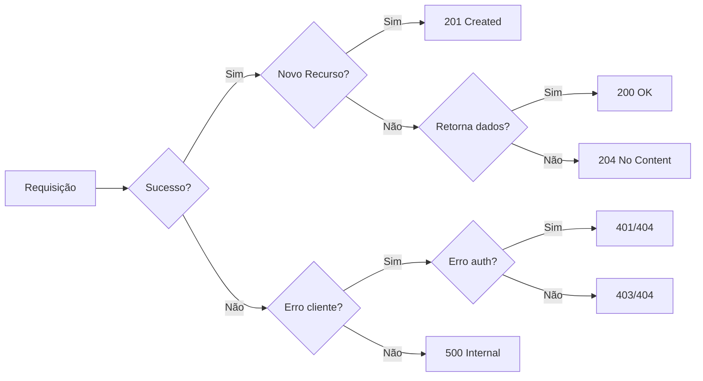

<script src="https://unpkg.com/pako@1.0.10/dist/pako_deflate.min.js" async></script>
<script>
document.addEventListener('DOMContentLoaded', function() {
    setTimeout(function() {
        Array.from(document.querySelectorAll('.language-mermaid')).map(function(pre) {
            const encoded = new TextEncoder('utf-8').encode(pre.textContent);
            const compressed = window.pako.deflate(encoded, { level: 9, to: 'string' });
            const urlencoded = btoa(compressed).replace(/\+/g, '-').replace(/\//g, '_');
            const url = `https://kroki.io/mermaid/svg/${urlencoded}`;
            const img = document.createElement('img');
            img.src = url;
            pre.replaceWith(img);
        });
    // Give marp some time to load itself etc...
    }, 1000);
});
</script>

# REST API: Por que você complica?

## Boas práticas para simplificar e melhorar suas APIs

---

# Quem sou eu
<div class="columns">
<div>

## Victor Raton (v_ratton)
- Dessenvolvedor fullstack +5 anos
- Cursando pós-graduação em Data science & Analytcs pelo SENAI - CIMATEC 
- Contribuidor independente em SDR Virtual e Wokpy

</div>

<div>


---

# O que NÃO é esta apresentação

- ❌ Criar API REST do zero
- ❌ Curso de HTTP
- ❌ Curso de FastAPI/Python

# O que É esta apresentação

- ✅ Conceitos RESTful
- ✅ Faciliitar a tomada de decisão e padronização
- ✅ Evitar erros comuns que causam problemas de performance 

> Para aprender a desenvolver uma API REST veja o curso do Eduardo Mendes (dunossauro) [FastAPI do zero](https://fastapidozero.dunossauro.com/estavel)

---

# REST API - Conceito

**Representational State Transfer**

- Transferência de estado de recursos
- Servidor HTTP entrega JSON
- Verbos: GET, POST, PUT, PATCH, DELETE
- Dados e metadados

---

# RESTful

> As APIs que seguem o estilo de arquitetura REST são chamadas de APIs REST. Os serviços da Web que implementam a arquitetura REST são chamados de serviços da Web RESTful

- AWS: O que é uma API RESTful.

---

# "RESTaurante"

| Verbo | Ação | Exemplo |
|-------|------|---------|
| GET | Ler cardápio | `/cardapio` |
| GET | Detalhes item | `/cardapio/12` |
| POST | Fazer pedido | `/pedido` |
| PATCH | Solicitar mudança de pedido (Remover abacaxi) | `/pedido/{id}` |
| PUT | Trocar pedido inteiro | `/pedido/{id}` |
| DELETE | Cancelar | `/pedido/{id}` |

---


# Status Codes - Comunicação Imediata

Repreesentação numérica usada pelo protocolo HTTP onde faixas representam os grupos

```
1xx → Informação
2xx → Sucesso     ← "Caminho feliz"
3xx → Redirecionamento
4xx → Erro do cliente
5xx → Erro do servidor
```
---

# Os Mais Importantes

| Código | Significado | Uso |
|--------|-------------|-----|
| 200 | OK | Sucesso geral |
| 201 | Created | POST/PUT criam recurso |
| 204 | No Content | DELETE bem-sucedido* |
| 401 | Unauthorized | Não autenticado |
| 403 | Forbidden | Sem permissão |
| 404 | Not Found | Recurso não existe |
| 500 | Internal Error | Erro no servidor |

---

# Escolhendo um status code 



---

# Headers HTTP - Metadados

> Informações extras sobre a requisição/transação

**Exemplos de uso:**
- Autenticação (Bearer token)
- Content-Type
- Cache policy
- Paginação

---
```http
HTTP/1.1 200 OK
Content-Type: application/json
Total-Count: 1000
Items-Per-Page: 10
Current-Page: 1
Items-Returned: 1
Link: </items?page=2>; rel="next"
```

---

# HATEOAS - Por que complica?

**Hypermedia as the Engine of Application State**

- Mapeando dados nos reetornos
- Links de referência para entidades

Formatos existentes:
- HAL, JSON:API, Siren, Hydra, Collection+JSON, UBER
---
# Problemas

- Serialização bloqueante para metadados
- Interfere no retorno dos dados
- Overhead mesmo em listas vazias

```json
{
  "_links": { "self": { "href": "..." } },
  "id": "1",
  "name": "Livro"
}
// Metadados no body = problema de performance
```

---

# Solução: Separar Dados de Metadados

> RFC 8288 - Web Linking

## Headers para metadados

```http
HTTP/1.1 200 OK
Content-Type: application/json
Total-Count: 1000
Total-Pages: 100
Items-Per-Page: 10
Current-Page: 1
Items-Returned: 1
Link: </items?page=2>; rel="next",
      </items?page=100>; rel="last"
```

---

## Body simples

```json
[
  { "id": 1, "title": "O Senhor dos Anéis" }
]
```

**Vantagem:** Metadados não bloqueiam leitura dos dados
**Desvantagem** Exige a necessidade de documentação externa exportada como OpenAPI/Swagger

---


# Teste de comparação: HATEOS vs HEAD metadata

---
# Metodologia de testes
1. Teste de carga por meio do utilitário `wrk`
    - Tempo de resposta médio
    - Total de requisições
    - 100 concorrenttes, 10 ml requisções 
2. Teste de cliente com request (Python)
    - Consumo de API
    - Tempo médio para consultar lista paginada
    - Tempo médio para consultar lista vazia
    - Uso de RAM em serialização
---
# Endpoint API
---
# Implementando Parser
---

# Resultados
---

# Boas Práticas

- ✅ POST/PUT → **201 Created**
- ✅ GET/HEAD → **200**
- ✅ DELETE → **204 No Content**
- ✅ Location header para recursos criados
- ⚠️ Moderar contadores em bases grandes
- ⚠️ Evitar headers customizados que proxies sobrescrevem

## Dica de Segurança

> Para prevenir brute-force: responder **404** em vez de **401** em falhas de autenticação

---

# Referências

- [RFC 8288 - Web Linking](https://datatracker.ietf.org/doc/html/rfc8288)
- [RFC 6648 - Deprecating "X-" Prefix](https://datatracker.ietf.org/doc/html/rfc6648)
- [MDN - HTTP Headers](https://developer.mozilla.org/en-US/docs/Web/HTTP/Reference/Headers)
- [FastAPI do Zero](https://fastapidozero.dunossauro.com/) - Curso recomendado
- [O que é uma API RESTful](https://aws.amazon.com/pt/what-is/restful-api/)

---

# FIM

## Perguntas?

**Código disponível em:**
`presentations/rest-api-simplificado.md`
